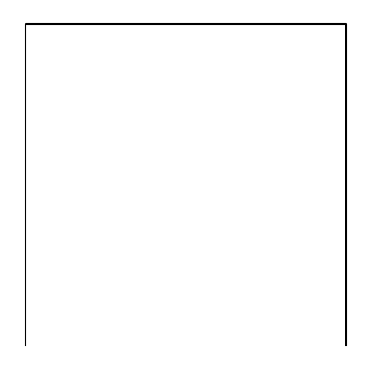
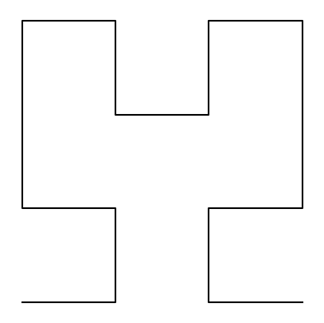
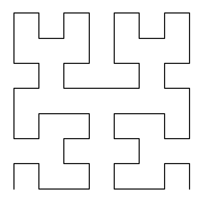
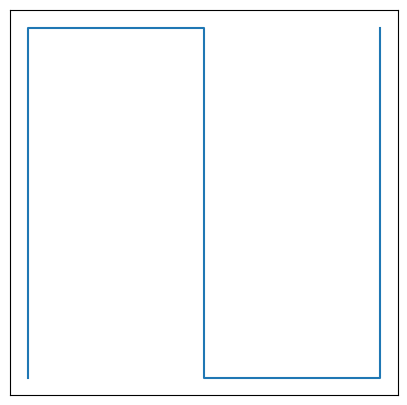
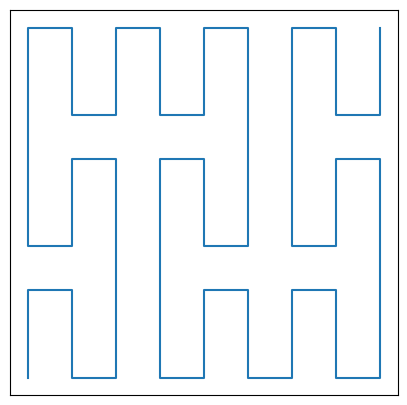
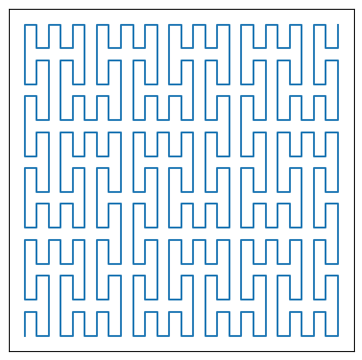

# Classic fractal's modifications

In this project we implemented two classic fractals, both being space-filling curves, i.e. Hilbert curve and Peano curve.

## What is space-filling curve?
Space-filling curve is a kind of function that for every point on unit interval ($$[0; 1]$$) corresponds to every point on unit square ($$[0; 1] \times [0; 1]]$$).
We implemented these two curves recursively, as their respective definitions are recursive too. That means, that what you see is not space-filling curve itself, but its iterations, which with number of iterations tending to infinity will grant space-filling curve.

## Usage
What are they for? Well, Peano curve was invented by mathematician Giuseppe Peano for his interest in prooving Cantor's statement that $$\displaystyle\mathop{\forall}_{n \in \mathbb{N}}\|\mathbb{R}\| = \|\mathbb{R}^n\|$$.
Though his curve is not bijection, it still proves this cardinality equation, while Hilbert curve is used in reduction of data dimensions.

## Examples
||
|:--:| 
| *Hilbert curve first iteration* |

||
|:--:| 
| *Hilbert curve second iteration* |

||
|:--:| 
| *Hilbert curve third iteration* |

||
|:--:| 
| *Peano curve first iteration* |

||
|:--:| 
| *Peano curve second iteration* |

||
|:--:| 
| *Peano curve third iteration* |

## Modifications
We also developed several modifications for both of these fractals based on starting shape or construction change.

### Credits
Developed by Piotr Kosakowski and Michał Legczylin.
